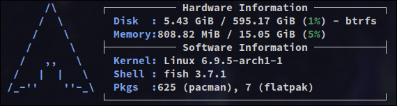

# HyprlandInstall
 ---install script for hyprland with clean UI---
(only arch linux)

 download zip and execute systemStart.sh in the terminal

 or

 sudo pacman -S git
 
 git clone https://github.com/BubJla/hyprlandInstall.git
 
 cd hyprlandInstall

chmod +x ./systemStart.sh
 
 ./systemStart.sh

Fastfetch:

Waybar:

